# 👋 Hi, I’m Albert R. Zhu

🎓 I hold a Bachelor’s degree in **Computer Science and Technology** with a minor in **Finance** from **UESTC**.

📚 I am currently pursuing my Master’s degree in **Computer Engineering** at **NUS**.

💼 I have worked as an intern development engineer at **Huawei Technologies Co., Ltd.**

## 🚀 Tech Snapshot

I maintain a consistent routine of solving algorithmic problems on LeetCode to sharpen my problem-solving skills and strengthen my foundational knowledge in data structures and algorithms.

<!---
Albertzry/Albertzry is a ✨ special ✨ repository because its `README.md` (this file) appears on your GitHub profile.
You can click the Preview link to take a look at your changes.
--->
